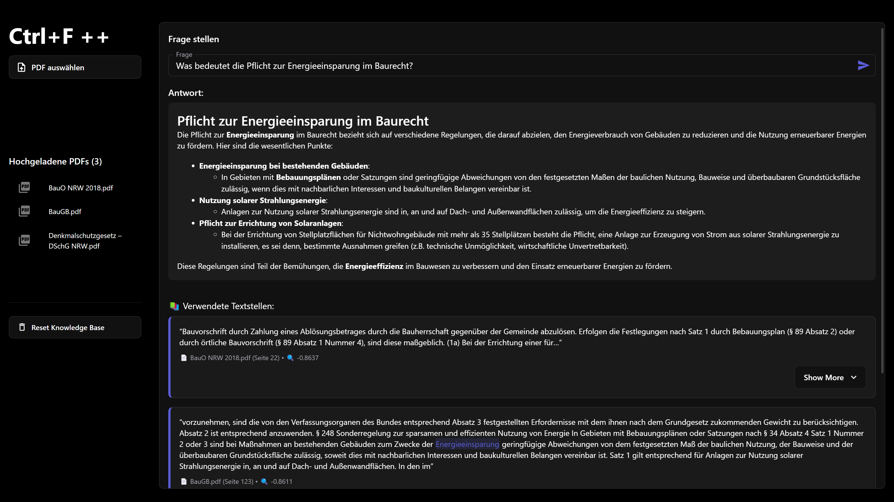
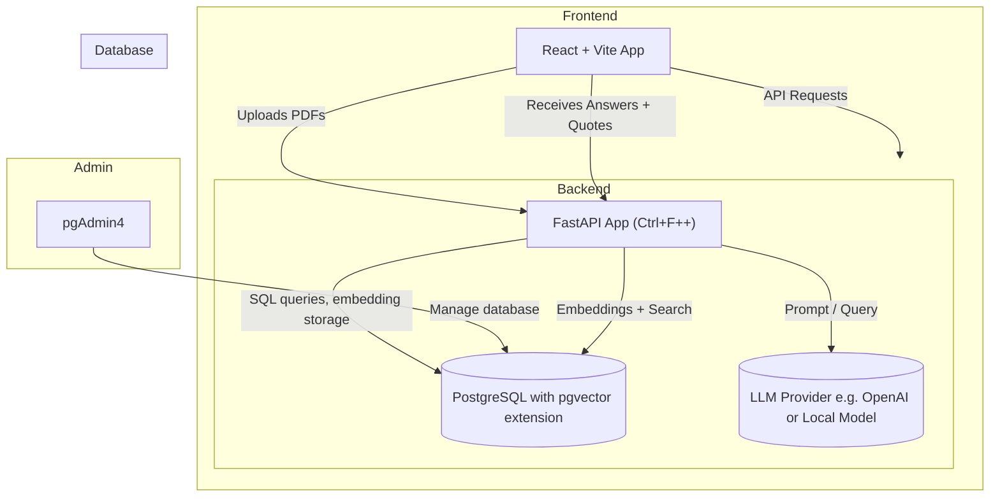

# Ctrl+F++

> An AI-enhanced "Ctrl+F" for complex documents.

**Ctrl+F++** is a lightweight full-stack GenAI app that lets users upload documents (like PDFs), embed them, and ask complex questions — powered by a local or cloud-based LLM.



Built with:

- 🧠 LangChain + Semantic vector search via pgvector (or FAISS, optional)
- 🐍 FastAPI for backend + embeddings
- ⚛️ React + TypeScript frontend
- ⚙️ LLM flexibility: switch between OpenAI (e.g., GPT-4o-mini) or local models (via Ollama)

---

---

## 🚀 Features

- 📄 Upload PDF documents
- 🔎 Chunk & embed content using sentence-transformers
- 💬 Ask natural-language questions
- 🔗Store vector embeddings in FAISS or pgvector
- 🤖 Get answers from OpenAI or Ollama (locally run LLMs)
- 🧹 Reset knowledge base anytime

---

## 🧪 Local Setup

### 1. Backend (FastAPI)

```bash
cd backend
python -m venv venv
.\venv\Scripts\Activate  # On Windows
pip install -r requirements.txt
uvicorn main:app --reload --port 8001
```

Create a .env file in backend/:

```
OPENAI_API_KEY=sk-...
LLM_PROVIDER=openai  # or ollama
```

### 2. Frontend (React + Vite)

```
cd frontend
npm install
npm run dev
```

---

## 🔁 LLM Configuration

Set the model provider in `.env`:

| `LLM_PROVIDER` | Description                   |
| -------------- | ----------------------------- |
| `openai`       | GPT-3.5 / GPT-4o-mini via API |
| `ollama`       | Local model via Ollama        |

## 🗂️ Repository Structure

```txt
ctrl-fpp/
├── backend/
│   ├── main.py                 # FastAPI app entry
│   ├── rag.py                  # Core RAG logic (embedding, retrieval, answering)
│   ├── pgvectorstore.py        # pgvector wrapper
│   ├── parser.py               # PDF/text chunker
│   ├── embedding_model.py      # Load and use embedding model
│   ├── llm_loader.py           # Configurable LLM loader (OpenAI, Ollama, etc.)
│   ├── vectorstore/            # Vector DB index + metadata
│   ├── data/docs/              # Uploaded PDF files
│   └── .env                    # Environment variables (API keys, LLM config)
│
├── frontend/
│   ├── src/
│   │   ├── App.tsx             # App wrapper with uploader + chat
│   │   ├── components/         # Upload, Ask, Reset UI
│   │   └── api.ts              # Axios setup
│   ├── vite.config.ts
│   ├── index.html
│   └── tsconfig.json
│
├── README.md
```

```
docker compose up -d --build
```

## Project Architecture



## Running with Docker

This project provides a ready-to-use `docker-compose.yml` for easy deployment.

### 1. Requirements

- Install [Docker Desktop](https://www.docker.com/products/docker-desktop/)

---

### 2. Environment Variables

Create a `.env` file in the project root (if not already present):

```bash
OPENAI_API_KEY=""
LLM_PROVIDER=""
POSTGRES_DB=""
POSTGRES_USER=""
POSTGRES_PASSWORD=""
POSTGRES_HOST=""
POSTGRES_PORT=""

PGADMIN_DEFAULT_EMAIL=""
PGADMIN_DEFAULT_PASSWORD=""

FRONTEND_ORIGINS=""
```

3. Build and Start
   To build and run the containers:

```bash
docker compose up --build
```

`db`: PostgreSQL with pgvector extension

`backend`: FastAPI server

`frontend`: React+Vite frontend (optional, runs with --profile ui)

Frontend is optional, you can start only DB + Backend like:

```bash
docker compose up backend db
```

Or include UI:

```bash
docker compose --profile ui up
```
